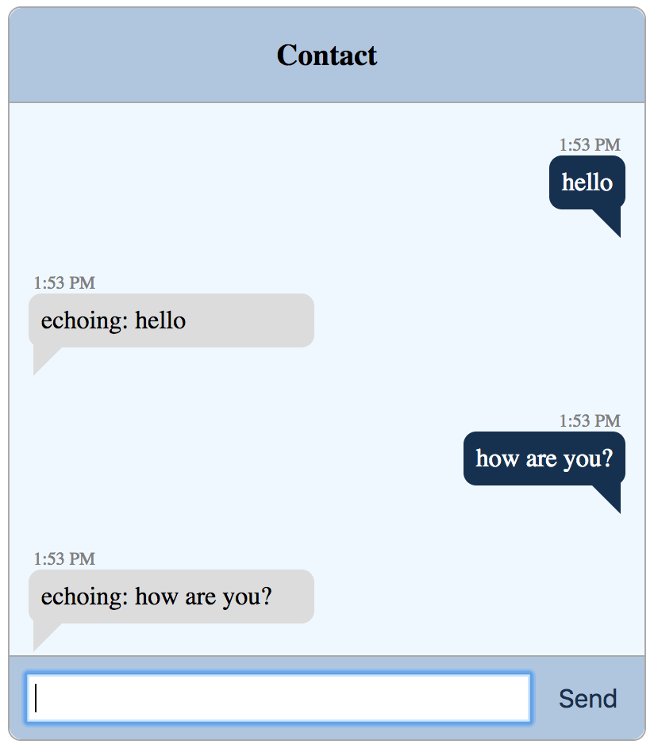

# khs-convo-emulator

A reusable React Chat UI Component that can be embedded or used in a standalone manner.



## Install and Run Test Emulator

Prereqs: Node.js Installed

`1.` Clone Repo

`2.` Run `npm start` Emulator should appear, any message sent will be echoed.

In the absence of a hosted `khs-convo` backend, this component will emulate sending messages, locally. This is the default.

## Adding To your Application

`./src/components/webconvo/webconvo.js` is the main component.

`import WebConvo from 'khs-convo-emulator';`

```jsx
<WebConvo
	apiKey={"<some_khs_convo_api_key_or_blank"}
	apiUrl={"<some_khs_convo_api_url_or_blank"}
	containerWidth={"<some_width_or_blank>"}
	myPhoneNumber={"<your_phone_number_or_blank>"}
	theirPhoneNumber={"<recipient_phone_number_or_blank>"}
/>
```


All of the properties are optional and have empty defaults.

## Building

[yarn](https://yarnpkg.com/lang/en/docs/install/) is required to build the project.

Note that building is not required to utilize the component in your project. It is ready for consumption after declaring the project as a dependency.

To build a production version:

```
$ yarn build
```

... which builds into `./dist`.

To build a development version:

```
$ yarn dev
```

... which builds into `./public` for the static server.

## Running the Server

`$ yarn start` will start a static server. It serves out of `./public`.
