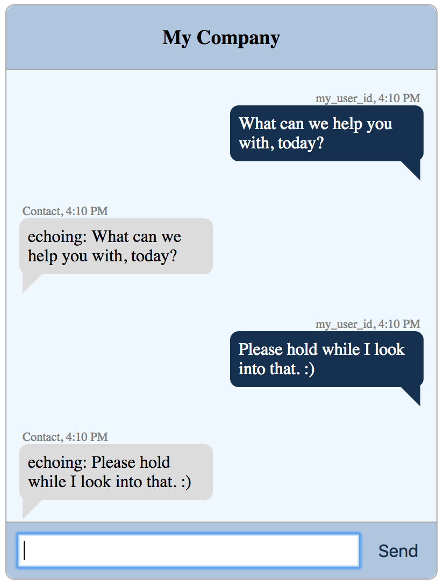

# khs-convo-emulator

A reusable React Chat UI Component that can be embedded or used in a standalone manner. 



## Install and Run Test Emulator 

Prereqs: Node.js Installed 

`1.` Clone Repo 

`2.` Run `npm start` Emulator should appear, any message sent will be echoed.  


## Adding To your Application

`./src/components/webconvo/webconvo.js` is the main component.

`import WebConvo from 'khs-convo-emulator';`

```jsx
<WebConvo 
	apiKey={"<some_khs_convo_api_key_or_blank"}
	apiUrl={"<some_khs_convo_api_url_or_blank"}
	containerWidth={"<some_width_or_blank>"} 
	myPhoneNumber={"<your_phone_number_or_blank>"} 
	theirPhoneNumber={"<recipient_phone_number_or_blank>"} 
/>
```


All of the properties are optional and have empty defaults.

## Building

Note that building is not required to utilize the component in your project. It is ready for consumption after declaring the project as a dependency. These next two sections cover project maintenance.

The `./.env` file has all the build-time environment variables, with comments. Values are, by default, empty. Leave these unpopulated for demo builds; otherwise, populate with a real API URL, data, etc.

You also have the option of creating a `./.env*.local` file (which are `git ignore`d) with populated values, in case you want to fork and avoid diff noise.

See this section in React Scripts for more details on overriding files and for which build phases they are applicable: 

[https://github.com/facebook/create-react-app/blob/master/packages/react-scripts/template/README.md#what-other-env-files-can-be-used](https://github.com/facebook/create-react-app/blob/master/packages/react-scripts/template/README.md#what-other-env-files-can-be-used)

Note that the main component `WebConvo` looks in both places, declared properties/values and environment variables, in that order, for setting its "mode" of operation. Neither are required, in which case, the component runs in emulation mode.

To build:

```
$ npm run build
``` 

## Developing and Testing

`$ npm start` will start a dev server serving a dev build.


